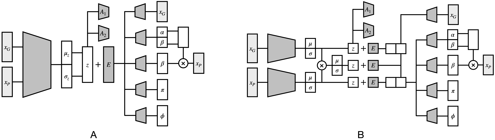

# MultiCPA

`MultiCPA` is a research project from a computatiobal biology group of Prof. Fabian 
Theis (https://github.com/theislab) from Helmholtz Zentrum München. 

## What is MultiCPA?


`MultiCPA` is a framework to learn effects of perturbations at the single-cell level for multiple modalities: `proteins` and `mRNAs`. 
MultiCPA encodes and learns phenotypic drug response across different cell types, doses and drug combinations. MultiCPA allows:

* Out-of-distribution predicitons of unseen drug combinations at various doses and among different cell types.
* Learn interpretable drug and cell type latent spaces.
* Estimate dose response curve for each perturbation and their combinations.
* Access the uncertainty of the estimations of the model.

## Package Structure

The repository is centered around the `MultiCPA` module:

* [`MultiCPA.train`](MultiCPA/train.py) contains scripts to train the model.
* [`MultiCPA.api`](MultiCPA/api.py) contains user friendly scripts to interact with the model via scanpy.
* [`MultiCPA.plotting`](MultiCPA/plotting.py) contains scripts to plotting functions.
* [`MultiCPA.model`](MultiCPA/model.py) contains modules of compert model.
* [`MultiCPA.data`](MultiCPA/data.py) contains data loader, which transforms anndata structure to a class compatible with compert model.

Additional files and folders for reproducibility are found in another repository: [multicpa-reproducibility](https://github.com/theislab/multicpa-reproducibility)

* [`datasets`](datasets/) contains both versions of the data: raw and pre-processed.
* [`preprocessing`](preprocessing/) contains notebooks to reproduce the datasets pre-processing from raw data.
* [`notebooks`](notebooks/) contains notebooks to reproduce plots from the paper and detailed analysis of each of the datasets.
* [`figures`](figures/) contains figures after running the notebooks.

Note that the codebase was build on top of `CPA` model.

## Usage

To learn how to use this repository, check [example_training.ipynb](https://github.com/theislab/multicpa-reproducibility/blob/main/notebooks/example_training.ipynb).
Note that hyperparameters in the demo are not default and will not work for new datasets. Please make
sure to run `seml` sweeps for your new dataset to find best hyperparameters. Provided Conda environments are strongly recommended. 

## Examples and Reproducibility
All the examples and the reproducibility notebooks for the plots in the paper could be found in the [multicpa-reproducibility](https://github.com/theislab/multicpa-reproducibility) repository.

## Documentation

Currently, you can access the documentation via `help` function in IPython. For example:

```python
from MultiCPA.api import ComPertAPI

help(ComPertAPI)

from MultiCPA.plotting import CompertVisuals

help(CompertVisuals)

```

A separate page with the documentation is coming soon.

## Support and contribute

If you have a question or noticed a problem, you can post an [`issue`](https://github.com/theislab/multicpa/).

## License

This source code is released under the BSD 3-Clause License, included [here](LICENSE).
